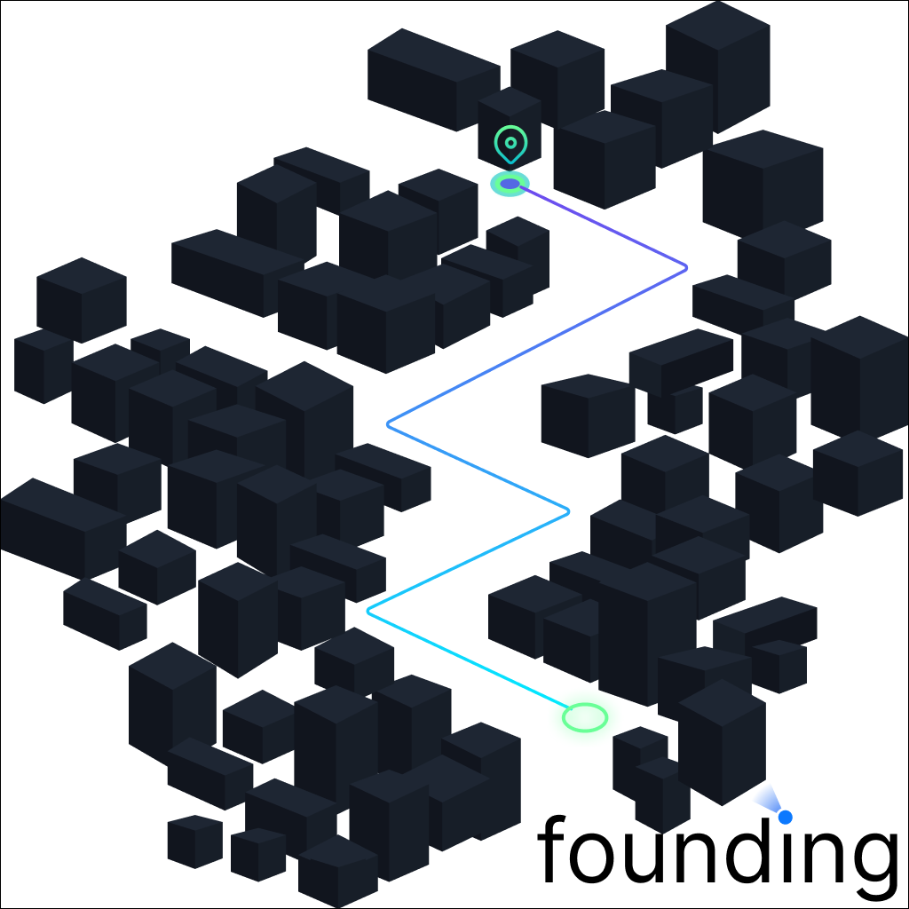

# founding - Mobile App



## Deskripsi Aplikasi
Aplikasi `founding` merupakan aplikasi yang berfungsi untuk mevisualisasikan peta global yang dapat dipakai untuk mengetahui penyebaran lahan dan mengetahui posisi dengan database yang disediakan walaupun fitur belum selesai 

## Dependensi atau Library (Expo)
- `@react-navigation/native-stack`: Digunakan untuk perutean dan navigasi di Aplikasi React Native dengan membantu memecahkan masalah navigasi di beberapa layar dan berbagi antar layar. 
- `@react-navigation/native`: membantu memecahkan masalah navigasi di beberapa layar dan berbagi antar layar.
- `expo`: Digunakan untuk mendevelop react native
- `expo-location`: Digunakan untuk mengontorol posisi dari perangkat.
- `react`: Digunakan untuk membangun user interface yang interaktif
- `react-native`: Digunakan untuk membuat aplikasi mobile di dua sistem operasi sekaligus yaitu Android dan IOS.
- `react-native-safe-area-context`: Digunakan untuk mengontorol informasi yang aman dari situs yang aman.
- `react-native-screens`: Digunakan untuk mengatur presentasi,tampilan, transisi antar layar, dan lain-lain.
- `react-redux`: Digunakan untuk mengelola data untuk menampilkan data bebas dengan library apa saja.
- `react-native-maps`: Digunakan untuk memanggil fungsi dan memvisualisasikan maps

## NOTE
Aplikasi dapat berjalan dengan normal disimulasi expo namun ketika dijalankan dengan model apk utuh terjadi crash

## VIDEO
`Demo dengan tools expo:`
https://user-images.githubusercontent.com/Hans299/shorts/65BZxyoha7I?rawtrue


## Cara Instalasi
Jalankan perintah di bawah ini untuk melakukan instalasi dependensi!

```
yarn
npm install (alternative command)
```

Setelah proses selesai, jalankan salah satu perintah ini untuk membuka aplikasi via expo:
```
npm start

```# founding
Aplikasi visualisasi lokasi dan mencari lahan yang dapat dipakai
